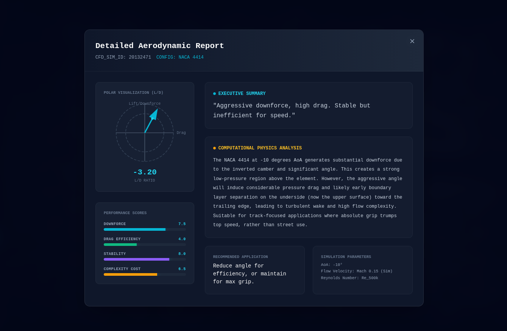

# aero_lab_v3
A wind tunnel simulation where you design your own spoiler


## Run Locally

Clone the repository
```bash
git clone https://github.com/grasgor/aero_lab_v3.git

cd aero_lab_v3
```

<p align="center">
  <video src="assets/demo.mp4" controls width="700"></video>
</p>


**Prerequisites:**  Node.js


1. Install dependencies:
   `npm install`
2. Set the `GEMINI_API_KEY` in [.env](.env) to your Gemini API key
3. Run the app:
   `npm run dev`
   Open http://localhost:3000 in your browser
   
**Note:** The simulation runs even without the gemini-api, however you will not be able to run simulation analysis. To run the silutation you will need to use it with a local LLM, you can change the local api end point in cloud provider section on the top left.


<p align="center">
  
</p>

